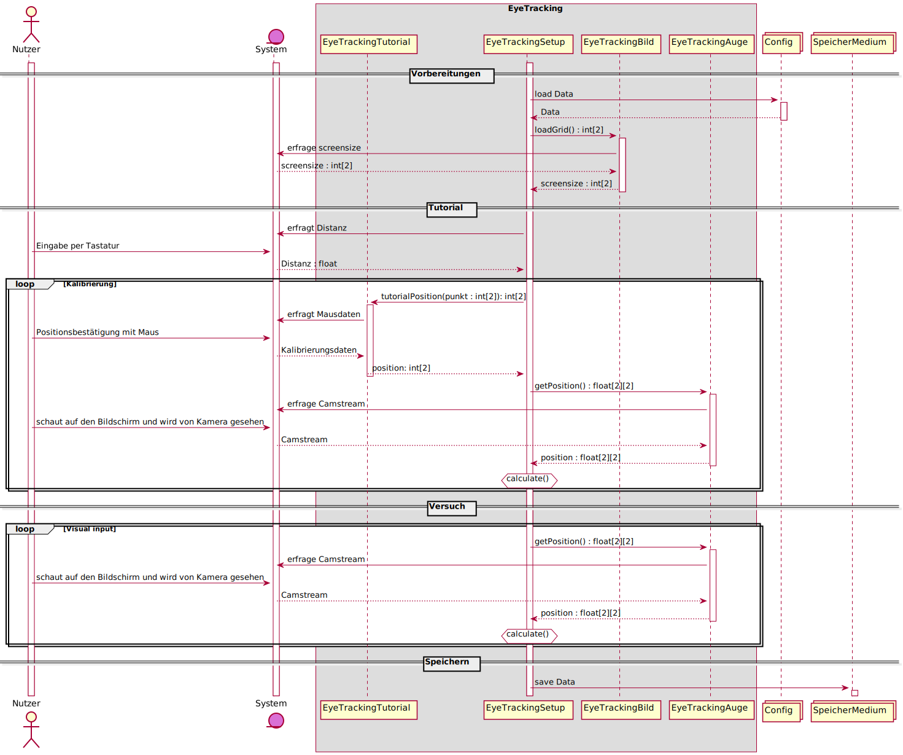
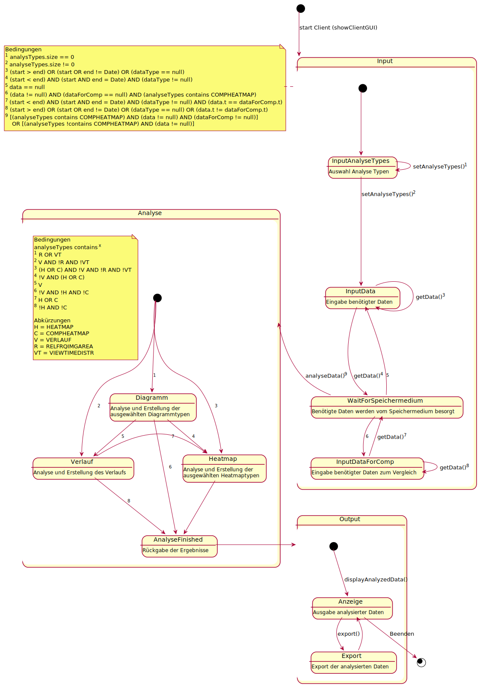
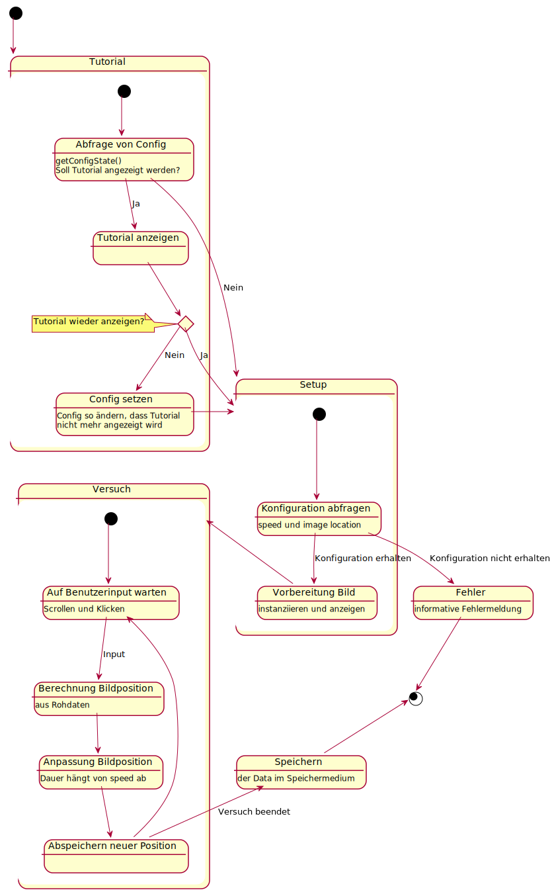

# Bericht zum Meilenstein 4

## Was ist seit dem letzten Meilenstein passiert ?
- Gruppentreffen am 11.11.2021: Aufgabenverteilung
- Erstellung eines Templates
- Ausarbeitung der Diagramme in Partnerarbeit mit Hilfe von PlantUML, VSCode und LiveShare
- Reviews der Module durch andere Gruppenmitglieder
- 16.11.2021 Gruppenbesprechung um Ergebnisse vorzustellen und letzte Fehler zu korrigieren

## Was waren die Herausforderungen und Probleme ? Wie wurden sie gelöst ?
- Bei der in der Aufgabenstellung vorgesehenen Menge an zu bearbeitenden Diagrammen hätten einige keine eigenen Diagramme zum Bearbeiten bekommen -> Bearbeitung eines zustzlichen Sequenz-, sowie eines zusätzlichen Zustandsdiagramms
- Es konnten nicht alle sowohl ein Sequenz-, als auch ein Zustandsdiagramm bearbeiten -> Gruppenmitglieder tauschten sich bei Interesse untereinander aus und erklärten sich gegenseitig das Vorgehen bei den unterschiedlichen Diagrammarten

## Was lief gut ? Was lief nicht gut ?
| gut | nicht gut |
| --- | --------- |
|Kommunikation innerhalb der Gruppe, sowie innerhalb der Module|Gruppe lies sich bei den Gruppentreffen durch die gute Atmosphäre schnell ablenken |
|Vorarbeit des letzten Meilensteins erleichterte die Arbeit     |Erkennung aller Bedingungen der Transitions (Zustandsdiagramm)           |
|Syntax von PlantUML war durch den letzten Meilenstein schon bekannt     |           |

## Was haben Sie gelernt ?
- Den Nutzen von Sequenz- und Zustandsdiagrammen
- Zeitliche Abläufe bei Sequenzdiagrammen genau zu spezifizieren
- Bedingungen bei Zustandsdiagrammen erkennen und formulieren
- Syntax von PlantUML wurde gefestigt
- Anderen Gruppenmitglieder das Vorgehen bei den selbst bearbeiteten Diagrammen verständlich zu erklären

## Was würden sie beim nächsten Mal anders machen ?
- Struktur in die Gruppenbesprechungen bringen um Ablenkungen möglichst zu reduzieren -> Bei Gruppentreffen festgesetzte Zeiten zum Arbeiten und festgesetzte Zeiten zum Unterhalten einplanen 

---
## Teilnehmer und Rollen.

- Verteilung der Aufgaben:
    | Aufgabe                         | Team           | Review         |
    | ------------------------------- | -------------- | -------------- |
    | Sequenzdiagramm AnalyseClient   | Philip, Justin | Sarah, Nils    |
    | Sequenzdiagramm ZoomMaps        | Sarah, Josh    | Philip, Justin |
    | Sequenzdiagramm EyeTracking     | Nils, Joni     | Sarah, Josh    |
    | Zustandsdiagramm AnalyseClient  | Philip, David  | Nils, Joni     |
    | Zustandsdiagramm ZoomMaps       | Josh,  Joni    | Philip, David  |
    | Zustandsdiagramm Speichermedium | Justin, David  | Josh, Joni     |
    | Dokumentation                   | Sarah, Nils    | alle           |

---

## Diagramme
### Sequenzdiagramm Analyseclient

### Sequenzdiagramm EyeTracking

### Sequenzdiagramm ZoomMaps

### Zustandsdiagramm Analyseclient

### Zustandsdiagramm Speichermedium

### Zustandsdiagramm ZoomMaps

